# Data Platform for Log Analytics - Teams AbnormalMeetings
> Deployment demo [_here_](https://microsoftapc.sharepoint.com/:v:/t/TeamDataAI/Ea6U99uXwe5DpVPYGeuovi8BL9PTb-tHT8YSNioVHMNENQ?e=8MJbCA). (Note: Please login with your microsoft account)

<!-- > Live demo [_here_](https://www.example.com). If you have the project hosted somewhere, include the link here. -->

## Table of Contents
* [Architecture](#architecture)
* [General Info](#general-information)
* [Steps to Demo](#steps-to-demo)
* [Setup](#setup)
* [Features](#features)
* [Technologies Used](#technologies-used)
* [Project Status](#project-status)
* [Room for Improvement](#room-for-improvement)
* [Acknowledgements](#acknowledgements)
* [File/Folder Architecture](#file--folder-architecture)
* [Contact](#contact)
<!-- * [Screenshots](#screenshots) -->
<!-- * [Usage](#usage) -->
<!-- * [License](#license) -->

## Architecture
- Services we used
    - 1 * Azure function app (3 * Azure Functions)
    - 3 * Graph APIs
        - [Subscription - change notifications](https://learn.microsoft.com/en-us/graph/api/resources/webhooks?view=graph-rest-1.0&preserve-view=true)
        - [Get event](https://learn.microsoft.com/en-us/graph/api/event-get?view=graph-rest-1.0&tabs=http)
        - [Get callRecord](https://learn.microsoft.com/en-us/graph/api/callrecords-callrecord-get?view=graph-rest-1.0&tabs=http)
        - [Get chatMessage](https://learn.microsoft.com/en-us/graph/api/chat-list-messages?view=graph-rest-1.0&tabs=http#request-2)
    - 1 * Blob storage (auto-created by the program)
    - ADX
- Work Flow
    - 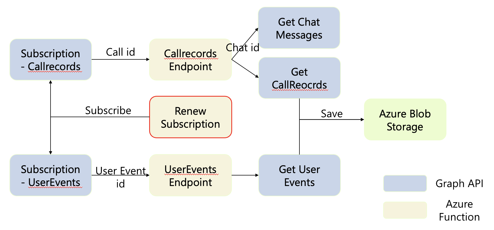
    - The `RenewSubscription` azure function is our entry point
    - It will subscribe for the resources that we needed, such as callRecord and user event. Then the information that we need will be sent to the endpoint azure functions.
    - Then the endpoint azure function will get the target resource using specific API and store them to our storage account.

## General Information
### Advantage
- This is a project about **Security**.
- If confidential disclosure happened, we can **utilize these logs** to find out who are the **suspicious insiders**.
### Problem Definition and Scenario
- Problem: Whether the insider exist in teams?
- Definition of an **insider**:
    - They may hold or join some abnormal meetings.
- Definition of an **abnormal meetings**:
    - 1 **on 1** meeting. (especially a meeting who’s email address ends with @gmail, @hotmail, etc. 
    - Screen sharing in meeting would be suspicious.

<!-- ### Why 30 minutes waiting is needed?
- Logs about the call will be recorded in the blob storage 30 minutes later after the meeting ends.
    - For example. If the meeting ends at 11:10. Logs about the call will be sent to blob storage at 11:40. -->

## Steps To Demo
### Prerequisite
1. Having a teams admin account.
    - You can create a demo account here. (https://cdx.transform.microsoft.com/my-tenants)
        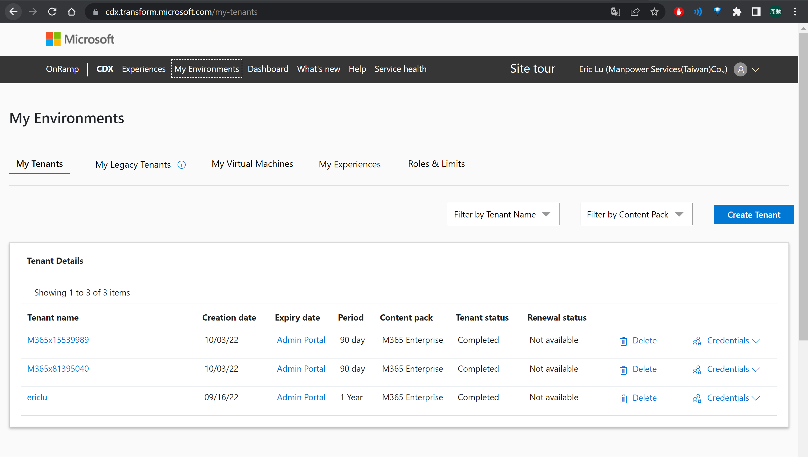
2. Register an Application having following permissions.
    1. User.Read.All (For "List Users“)
    2. Calendars.Read (For "List Events“)
    3. CallRecords.Read.All (For "CallRecords“)
    - How to add permissions
        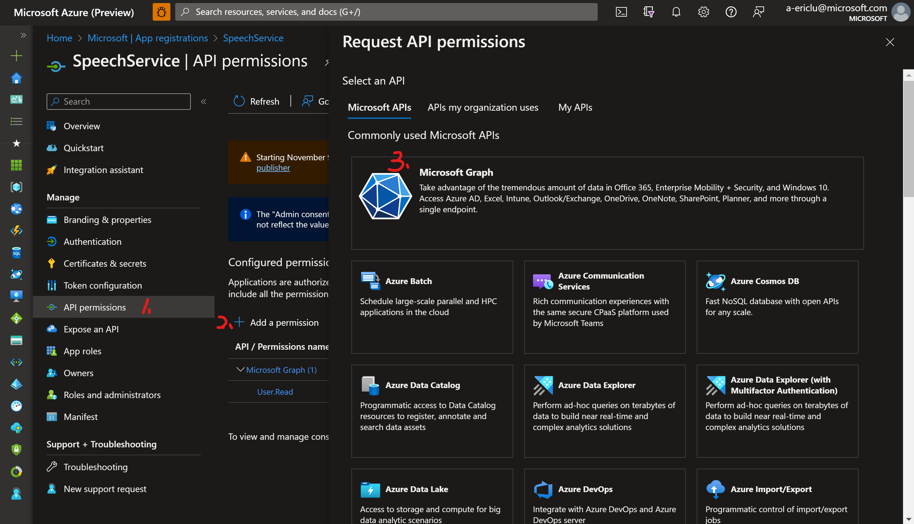

### Deployment
1. Publish the project.
    - Open the project in Visual Studio 2022. (The project can be clone from Github.)
    - Publish it to Azure Functions (You can also create a new one here).
        - Right click "Publish..." in Visual Studio 2022
            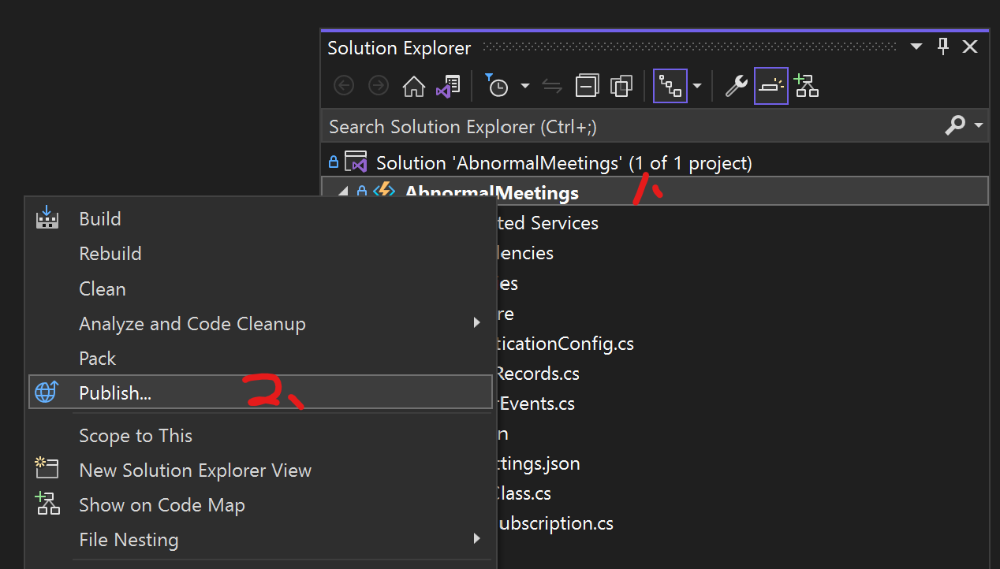
        - Choose to publish in "Azure" -> "Azure Function App (Windows) -> "AbnormalMeetings"
            > Or just **Create new** here. (recommanded)
            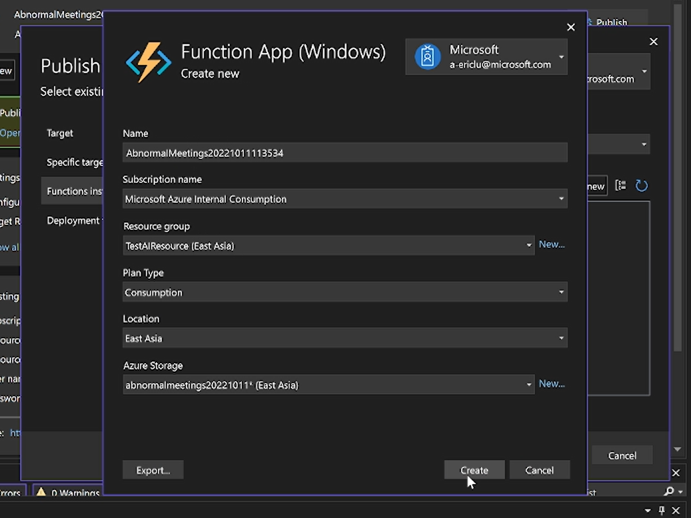
        - Click "finish" botton
            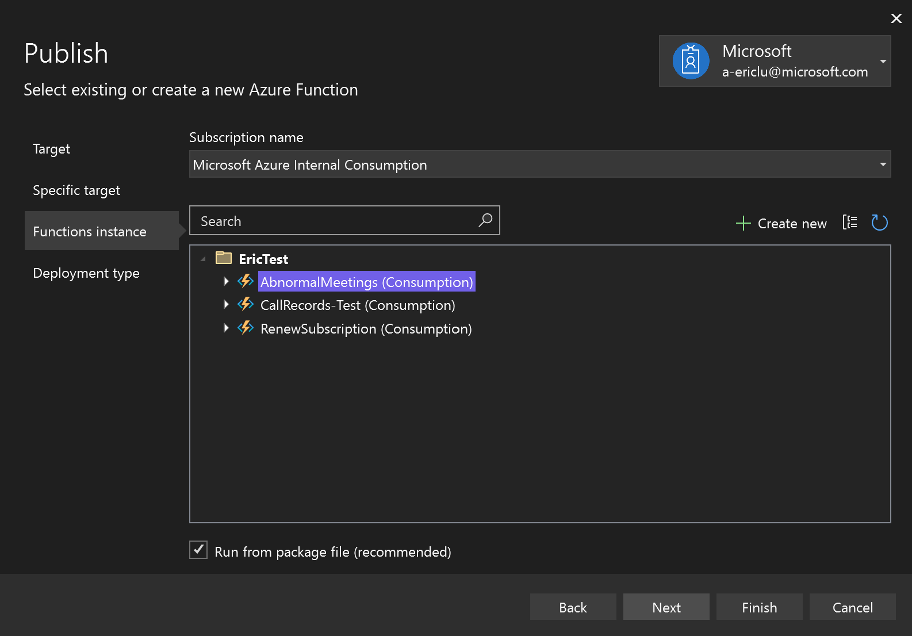
        - Then click "publish" button.
            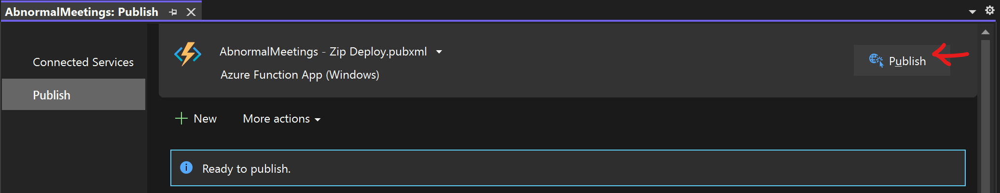
2. Fill in needed configuration
    > You can fill one after one by yourself. Or use my tool below to generate config by copy-and-paste
    - The explination of the config [_here_](#setting-environment-variables-configuration)
    - Fill needed parameters in `src\AbnormalMeetings\local.settings.json` & `AssistTools\originalConfig.json`
        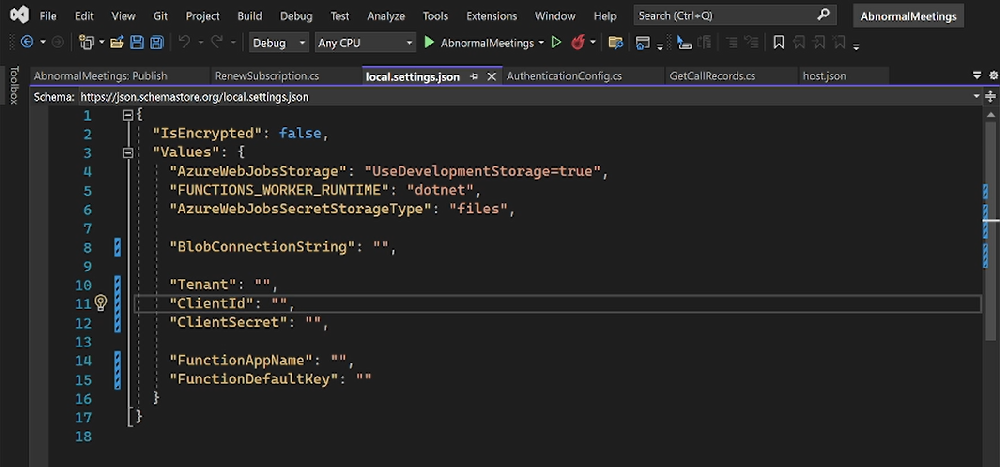
        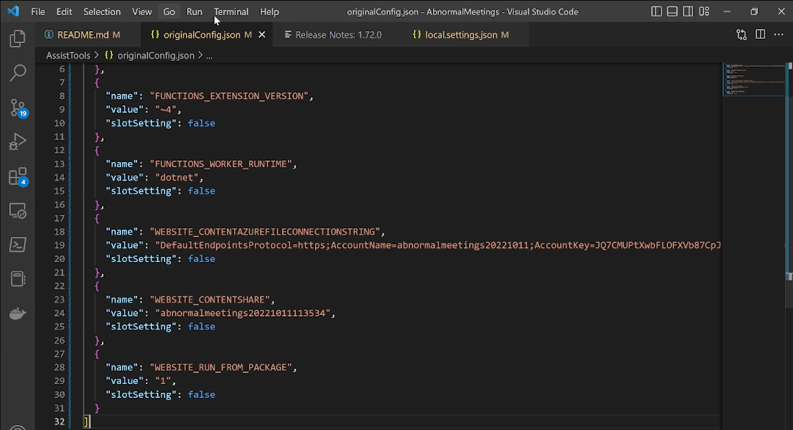
    - Run the python script `AssistTools\settingsToConfig.py` (this is a tool that I write to save time to fill the config one after one)
        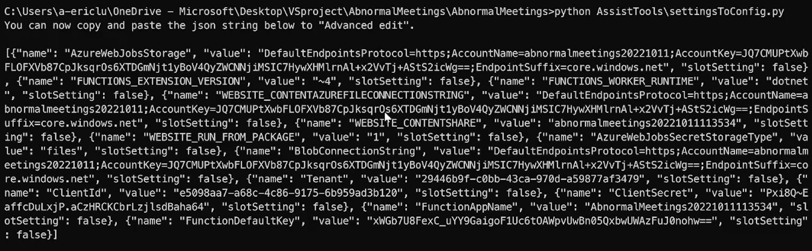
    - Paste config to azure function configuration.
3. Initialize the service
    - Use postman to trigger "renewsubscription" to subscribe all needed resource
        - POST to `https://<Endpoint_Name>.azurewebsites.net/admin/functions/RenewSubscription`
            - Headers: 
                - `x-functions-key`: `<your_master_key>`
                - `Content-Type`:`application/json`
            - Body: `{ "input": "test" }`
        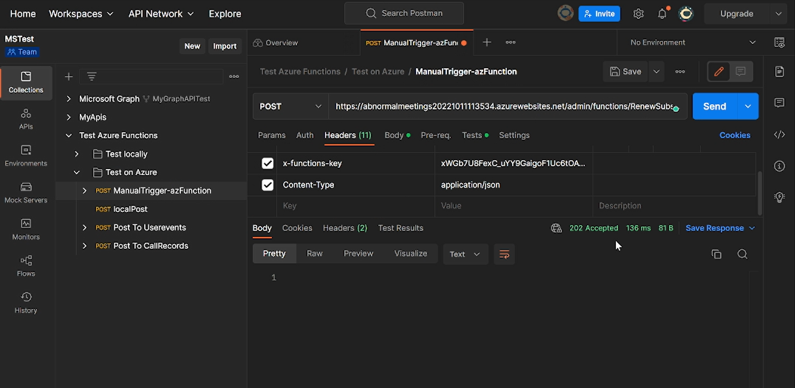
        
4. Bind with ADX
    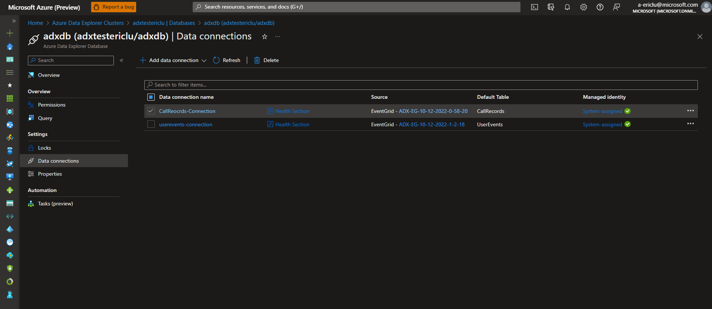

<!-- - Step 1: Clone this project.
- Step 2: Create a [Function App named "AbnormalMeetings"](#create-function-app)
- Step 3: [Deploy source code to Azure.](#deploy-source-code)
- Step 4: [Setup environment variables.](#setting-environment-variables-configuration)
- Step 5: Manually trigger the timer function (TODO) -->
### Demo
#### UserEvents
- Step 1: [Create/Modify] a event in [outlook/teams].
- Step 2: **Wait 30 sec.**
- Step 3: Go to your `blob storage` or `ADX` to check your log!
    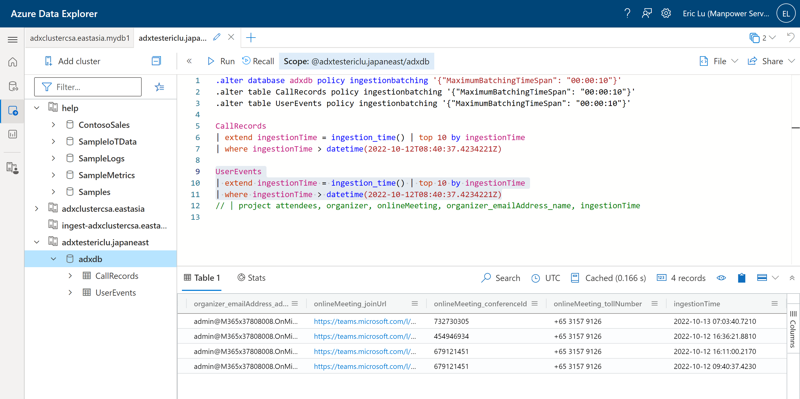
#### CallRecords
- Step 1: [Join/Create] a [call/meeting] in teams.
- Step 2: Wait others to join.
- Step 3: [Share/not share] your screen.
- Step 4: After all tests, end the [call/meeting].
- Step 5: **Wait 30 minutes.** 
- Step 6: Go to your `blob storage` or `ADX` to check your log!

<!-- ## Screenshots
- Successfully Run in VS
     -->
<!-- If you have screenshots you'd like to share, include them here. -->

## Setup
<!-- ### Required API permissions
> Please make sure that you have all API permissions below.
- User.Read.All
    - For "List Users"
- Calendars.Read
    - For "List Events"
- CallRecords.Read.All
    - For "CallRecords"
#### How to add permissions?
 -->

<!-- ### Create Bolb storage and containers
- we create a blob storage named `abnormalmeetingstorage`
- then create three containers
    - callrecords-container
    - subscription-container
    - userevents-container
    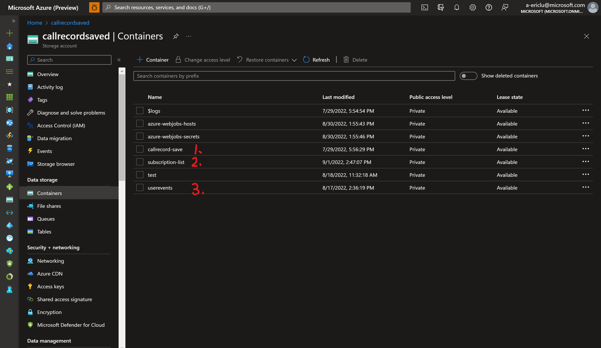 -->


<!-- TODO: create a function app when deploying using vs -->
<!-- ### Create Function App
- Go to Azure Portal
    - Go to "Function App" -> Create a function app named "AbnormalMeetings" 
        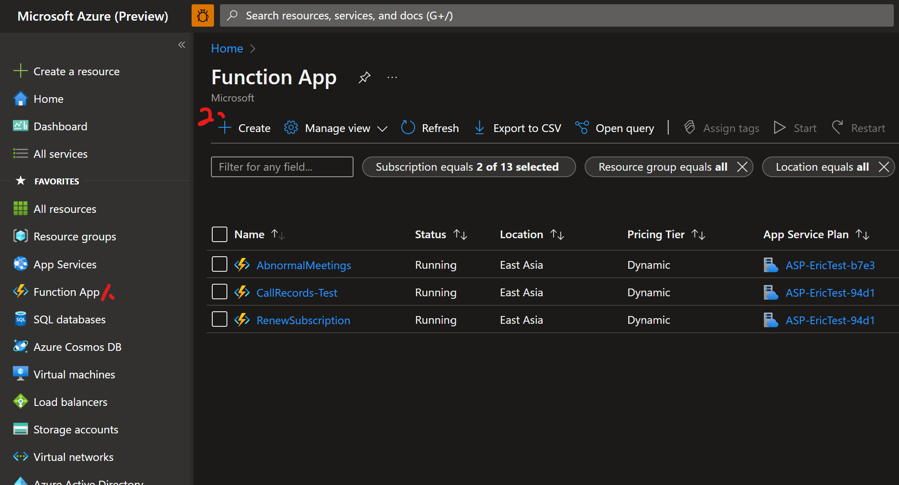 -->
<!-- ### Deploy Source Code
- Open project in `src` folder using Visual Studio 2022
- Right click "Publish..." in Visual Studio 2022
    
- Choose to publish in "Azure" -> "Azure Function App (Windows) -> "AbnormalMeetings"
    - Or just **Create new** here.(recommanded)
- Click "finish" botton
    
- Then click "publish" button.
    
- **Well done!** The function app has been deployed in Azure. -->
### Setting Environment Variables (Configuration)
- Belows are all needed configuration variables.
- If you are deploying them on Azure, please go to "Function App" -> "AbnormalMeetings" -> "Configuration" (in settings) and add/modify the configuration.
    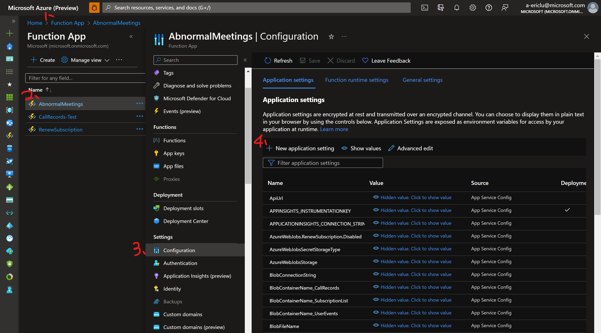

#### Variables Needed Modified
- local.setting.json
    ```json
    {
        "IsEncrypted": false,
        "Values": {
            "AzureWebJobsStorage": "UseDevelopmentStorage=true",
            "FUNCTIONS_WORKER_RUNTIME": "dotnet",
            "AzureWebJobsSecretStorageType": "files",
            "IsChatApi": "true",

            "BlobConnectionString": "",

            "Tenant": "",
            "ClientId": "",
            "ClientSecret": "",

            "FunctionAppName": "",
            "FunctionDefaultKey": ""
        }
    }
    ```
#### Using Chat Api
- "IsChatApi"
    - This is a feature flag that is used to decide whether the application can get the chatMessage

#### Blob storage related
- "BlobConnectionString"
    - `BlobConnectionString` is the blob connectionstring, where you want to store your data. In this case, it is the connection string of `abnormalmeetingstorage`

#### Azure Active Directory
- "Tenant",
- "ClientId",
- "ClientSecret",
##### How to get `Tenant`, `ClientId`, `ClientSecret`
- You have already get the `ClientSecret` [here](#prerequisite)
- Go to "Azure Active Dirrectory" -> "App Registrations" -> "Overview" and record several infornmation
    - `Tenant`: Specified in "Directory (tenant) ID"
    - `ClientId`: Specified in "Application (client) ID"

#### Function URLs (for webhook)
- "FunctionAppName"
    - The name of your azure function app (endpoint)
- "FunctionDefaultKey"
    - The master key of azure function app

## Features 
> Here we describe what each .cs file does.
### RenewSubscription.cs
- All subscription-related tasks will be done here.
- The program will read the json file specifiled in `BlobFileName`, under the container specified in `BlobContainerName_SubscriptionList`. 
- The json file's format is, for example, 
    ```json
    {
        "value":[
            {
                "UserId":"7f5b5e74-ba40-4aed-95be-d55a57e684fa",
                "SubscriptionId":"b32157a5-3dfc-4743-b84b-5dcb6c90c0ed"
            },
            ...,
            {
                "UserId":"callRecordId","SubscriptionId":"b6978c22-d086-47de-8f0b-31e68a5302f8"
            }
        ]
    }        
    ```
#### Renew CallRecords Subscription
- If the CallRecords have been subscribed before and have been recorded in `BlobFileName` ("UserId":"callRecordId"), just simply renew the subscription; otherwise, create a subscription and record it into `BlobFileName`.
#### Renew UserEvent Subscriptions
- I will get all users under the target tenant, if the user have been subscribed before and have been recorded in `BlobFileName` ("UserId":"{TheUserId}}"), just simply renew the subscription; otherwise, create a subscription and record it into `BlobFileName`.
### GetCallRecords.cs
- When the program recieves http request from the subscription resource, the program will be triggered.
- Use the call Id to get the callrecord and save it as a json file to container specified in `BlobContainerName_CallRecords`, using graph api SDK
    ```C#
    CallRecord callrecord = await graphServiceClient.
    // Here we used "Expand" to get full infornmation
    // in callrecord
    Communications.CallRecords[call_Id]
                    .Request()
                    .Expand("sessions($expand=segments)")
                    .GetAsync();
    ```
- If the environment variable `IsChatApi` is `true`, we are going to get the chatMessage from chatMessage API
    ```C#
    // Get the chat id from regex
    string chatid = matches[0].Value; 
    string resource = $"chats/{chatid}/messages";
    string webApiUrl = $"{config.ApiUrl}v1.0/{resource}"; // combine the resource to endpoint api
    HttpResponseMessage response = await httpClient.GetAsync(webApiUrl);
    ```
### GetUserEvents.cs
- When the program recieve http request from the subscription resource, the program will be triggered.
- Use the `resource` to get the event object and save it as a json file to container specified in `BlobContainerName_UserEvents`, using Http request.
    ```C#
    // The resource are the target
    // of user event subscription resource
    string resource = subscriptionData.value[0].resource;
    string webApiUrl = $"{config.ApiUrl}v1.0/{resource}";
    HttpResponseMessage response = await httpClient.GetAsync(webApiUrl);
    ```

## Technologies Used
### Azure Functions Core Tools
- Core Tools Version: 4.0.4736 Commit hash: N/A  (64-bit)
- Function Runtime Version: 4.8.1.18957

### PackageReference
- "Microsoft.NET.Sdk.Functions" - Version="4.0.1"
- "Microsoft.Graph" - Version="4.35.0"
- "Microsoft.Identity.Client" - Version="4.45.0"
- "Microsoft.Identity.Web" - Version="1.25.1"
- "Microsoft.Azure.WebJobs.Extensions.Storage.Blobs" - Version="5.0.1"

## Project Status
Project is: _complete_
<!--
Project is: _in progress_ / _complete_ / _no longer being worked on_. If you are no longer working on it, provide reasons why.
-->

## Room for Improvement
- Error handling functions 

## Acknowledgements
Many thanks to Goerge Liang, my mentor in MS.
<!-- 
Give credit here.
- This project was inspired by...
- This project was based on [this tutorial](https://www.example.com).
- Many thanks to...
-->

## File / Folder Architecture
### Folder
- AssistTools: Can use this to generate configuration to fill in azure
- img: all image files for README.md
- src: source code of project

## Contact
Created by [@Eric](https://github.com/yhlu0923/) - feel free to contact me!
<!-- 
Created by [@flynerdpl](https://www.flynerd.pl/) - feel free to contact me!
-->

<!-- Optional -->
<!-- ## License -->
<!-- This project is open source and available under the [... License](). -->

<!-- You don't have to include all sections - just the one's relevant to your project -->
