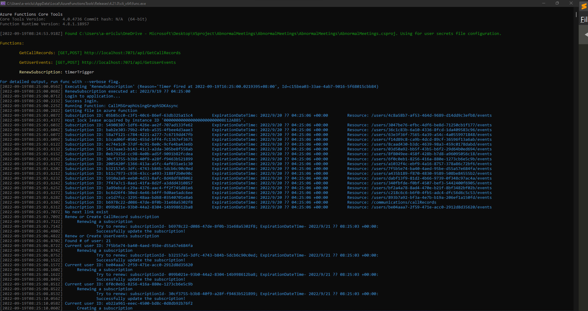

# Data Platform for Log Analytics
> Especially for Abnormal Meetings.

<!-- > Live demo [_here_](https://www.example.com). If you have the project hosted somewhere, include the link here. -->

## Table of Contents
* [General Info](#general-information)
* [Technologies Used](#technologies-used)
* [Features](#features)
* [Screenshots](#screenshots)
* [Setup](#setup)
* [Usage](#usage)
* [Project Status](#project-status)
* [Room for Improvement](#room-for-improvement)
* [Acknowledgements](#acknowledgements)
* [Contact](#contact)
<!-- * [License](#license) -->


## General Information
- TSMC want to know whether the insiders exist in Teams.
- The abnormal meeting has two characteristics.
    1. 1 on 1 meeting, especially meeting with the one using personal email.
    2. Screen sharing in the meeting.
- This project is tended to find out 
    1. How many people are there in the call?
    2. Is screen sharing in the meeting?
    3. Email addresses of the call participates.
- Finally, we write the information to Azure storage container.


## Technologies Used
### Azure Functions Core Tools
- Core Tools Version: 4.0.4736 Commit hash: N/A  (64-bit)
- Function Runtime Version: 4.8.1.18957

### PackageReference
"Microsoft.NET.Sdk.Functions" - Version="4.0.1"
"Microsoft.Graph" - Version="4.35.0"
"Microsoft.Identity.Client" - Version="4.45.0"
"Microsoft.Identity.Web" - Version="1.25.1"
"Microsoft.Azure.WebJobs.Extensions.Storage.Blobs" - Version="5.0.1"

## Features 

### RenewSubscription.cs
- All subscription-related tasks will be done here.
- The program will read the json file specifiled in `BlobFileName`, under the container specified in `BlobContainerName_SubscriptionList`. 
- The json file's format is, for example, 
    ```
    {
        "value":[
            {
                "UserId":"7f5b5e74-ba40-4aed-95be-d55a57e684fa",
                "SubscriptionId":"b32157a5-3dfc-4743-b84b-5dcb6c90c0ed"
            },
            ...,
            {
                "UserId":"callRecordId","SubscriptionId":"b6978c22-d086-47de-8f0b-31e68a5302f8"
            }
        ]
    }        
    ```
#### Renew CallRecords Subscription
- If the CallRecords have been subscribed before and have been recorded in `BlobFileName` ("UserId":"callRecordId"), just simply renew the subscription; otherwise, create a subscription and record it into `BlobFileName`.
#### Renew UserEvent Subscriptions
- I will get all users under the target tenant, if the user have been subscribed before and have been recorded in `BlobFileName` ("UserId":"{TheUserId}}"), just simply renew the subscription; otherwise, create a subscription and record it into `BlobFileName`.
### GetCallRecords.cs
- When the program recieves http request from the subscription resource, the program will be triggered.
- Use the call Id to get the callrecord and save it as a json file to container specified in `BlobContainerName_CallRecords`, using graph api SDK
    ```C#
    CallRecord callrecord = await graphServiceClient.
    // Here we used "Expand" to get full infornmation
    // in callrecord
    Communications.CallRecords[call_Id]
                    .Request()
                    .Expand("sessions($expand=segments)")
                    .GetAsync();
    ```
### GetUserEvents.cs
- When the program recieve http request from the subscription resource, the program will be triggered.
- Use the `resource` to get the event object and save it as a json file to container specified in `BlobContainerName_UserEvents`, using Http request.
    ```C#
    // The resource are the target
    // of user event subscription resource
    string resource = subscriptionData.value[0].resource;
    string webApiUrl = $"{config.ApiUrl}v1.0/{resource}";
    HttpResponseMessage response = await httpClient.GetAsync(webApiUrl);
    ```

## Screenshots
- Successfully Run in VS
    
<!-- If you have screenshots you'd like to share, include them here. -->


## Setup
### Deployment
1. Go to Azure
    - Go to "Function App" -> Create a function app named "AbnormalMeetings" 
2. Open Visual Studio
    - Right click "Publish.." in Visual Studio
    - Choose to publish in "Azure" -> "Azure Function App (Windows) -> "AbnormalMeetings"
    - Click "finish" botton
    - Then click "publish" button. The function app will be deployed in Azure.
### Configuration
<!--
- The specified location will be 
    1. Deployed Azure: in the environment variable
    2. Local develop (Visual Studio): local.setting.json
-->
- Belows are all needed configuration variables.
- If you are deploying them on Azure, please go to "AbnormalMeetings" -> "Configuration" (in settings) and specified them.
- If you are developing them locally, please go to "local.settings.json" and specified them.
#### Blob storage
- "AzureWebJobsSecretStorageType": "files",
- "BlobConnectionString",
- "BlobContainerName_CallRecords",
- "BlobContainerName_UserEvents",
- "BlobContainerName_SubscriptionList": "subscription-list",
- "BlobFileName": "subscriptionList.json",
##### Explanation
- `BlobConnectionString` is the blob connectionstring, where you want to store your data
- `BlobContainerName_CallRecords`, `BlobContainerName_UserEvents` are the containers that are used to store results after calling graph api
- `BlobContainerName_SubscriptionList` is the container that used to store the `BlobFileName`, which will be used in subscription.
#### Azure Active Directory
- "Instance": "https://login.microsoftonline.com/{0}",
- "ApiUrl": "https://graph.microsoft.com/",
- "Tenant",
- "ClientId",
- "ClientSecret",
##### How to get `Tenant`, `ClientId`, `ClientSecret`
1. Go to "Azure Active Dirrectory" -> "App Registrations" -> Create a application
2. Go to "Api Permission" -> Add permissions
    - User.Read.All
        - For "List Users"
    - Calendars.Read
        - For "List Events"
    - CallRecords.Read.All
        - For "CallRecords"
3. Go to "Certificates & secrets", create a client secret, let's says `ClientSecret`
4. Go to "Overview" and record several infornmation
    - `Tenant`: Specified in "Directory (tenant) ID"
    - `ClientId`: Specified in "Application (client) ID"
#### Function URLs (for webhook)
- "Webhook_CallRecords",
- "Webhook_UserEvents"
##### How to get `Webhook_CallRecords`, `Webhook_UserEvents`
-After you deployed the function app to Azure, go to "AbnormalMeetings" -> "Funtions" -> "GetCallRecords" or "GetUserEvents" -> "get function url" to get the webhook urls

## Usage
- After deployment and setting configuration, the function will start working!
- You can go to "Monitor" in functions to monitor the logs of azure functions

## Project Status
Project is: _complete_
<!--
Project is: _in progress_ / _complete_ / _no longer being worked on_. If you are no longer working on it, provide reasons why.
-->

## Room for Improvement
- Error handling functions 

## Acknowledgements
Many thanks to Goerge Liang, my mentor in MS.
<!-- 
Give credit here.
- This project was inspired by...
- This project was based on [this tutorial](https://www.example.com).
- Many thanks to...
-->

## Contact
Created by [@Eric](https://github.com/yhlu0923/) - feel free to contact me!
<!-- 
Created by [@flynerdpl](https://www.flynerd.pl/) - feel free to contact me!
-->

<!-- Optional -->
<!-- ## License -->
<!-- This project is open source and available under the [... License](). -->

<!-- You don't have to include all sections - just the one's relevant to your project -->